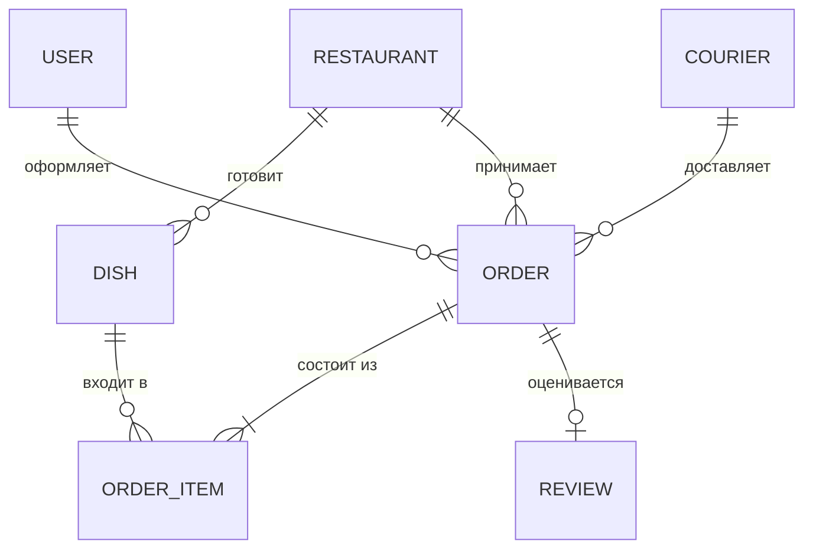
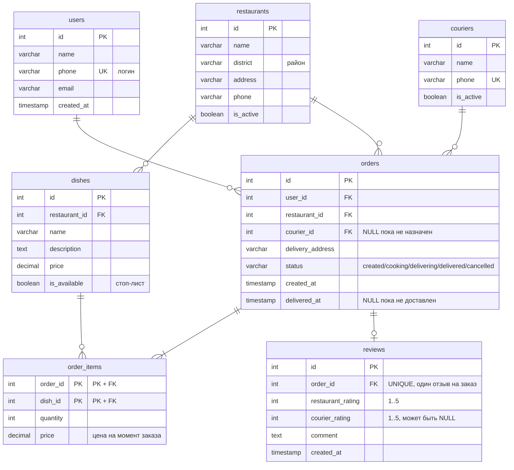
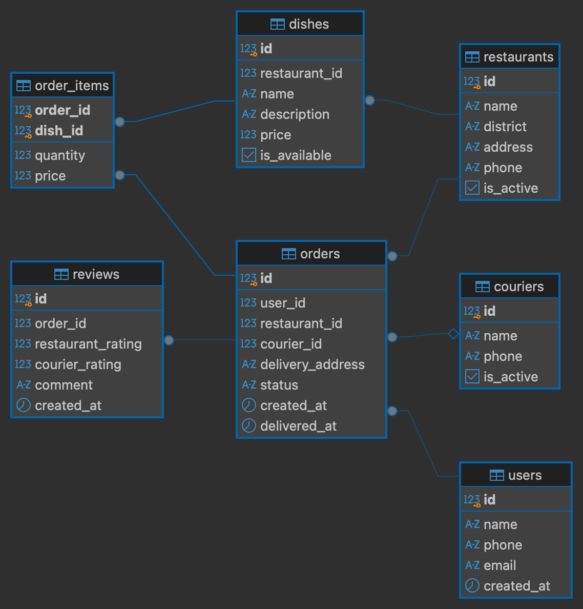

# Домашнее задание №1. Вариант 2, «Служба доставки еды»

Здесь три модели одного сервиса: концептуальная, логическая и физическая

## Предметная область

Сервис доставки еды из ресторанов. Пользователь смотрит рестораны и их меню, собирает заказ из нескольких блюд, указывает адрес доставки. Ресторан готовит, курьер везёт. После доставки пользователь может оценить и ресторан, и работу курьера.

## Концептуальная модель



Пользователи, рестораны и курьеры названы в условии прямо. Блюда взялись из фразы «у каждого ресторана есть меню с блюдами», заказы и отзывы тоже упомянуты явно. Единственная сущность, которой в тексте условия нет, это позиция заказа.
Она появилась вот почему. В заказе много блюд, и каждое блюдо попадает во много разных заказов, то есть связь между заказами и блюдами получается «многие ко многим». В реляционной модели такую связь нельзя выразить напрямую: в ячейку таблицы не положишь список. Приходится заводить третью таблицу, где каждая строка это пара «заказ плюс блюдо». Заодно в ней нашлось место для количества порций, которого нет ни у заказа целиком, ни у блюда.

## Логическая модель



### Кардинальность связей

| Связь | Кардинальность | Как читать |
|---|---|---|
| users → orders | 1 : 0..N | зарегистрировался ещё не значит заказал |
| restaurants → dishes | 1 : 0..N | у ресторана много блюд, блюдо только у одного ресторана |
| restaurants → orders | 1 : 0..N | заказ всегда из одного ресторана |
| couriers → orders | 1 : 0..N | у курьера много заказов, заказ может быть пока без курьера |
| orders → order_items | 1 : 1..N | пустых заказов не бывает |
| dishes → order_items | 1 : 0..N | блюдо могли ни разу не заказать |
| orders → reviews | 1 : 0..1 | отзыв дело добровольное, но второй оставить нельзя |

### Идентифицирующие и неидентифицирующие связи

Связь идентифицирующая, если ключ родителя входит в первичный ключ ребёнка. Проще говоря, ребёнок не может существовать сам по себе.

Такая связь здесь одна: orders и order_items. Первичный ключ позиции это пара `(order_id, dish_id)`, и половина ключа взята у заказа. Позиция без заказа бессмысленна.

У такого ключа есть побочный плюс, который я заметил уже после того, как его выбрал. Раз пара уникальна, то одно и то же блюдо физически нельзя добавить в заказ дважды, база не даст вставить вторую такую строку. Вместо этого надо увеличить quantity, что как раз и требуется по логике сервиса.

Остальные связи неидентифицирующие: у блюда, заказа и отзыва есть собственный id, а ссылка на родителя лежит в обычной колонке.

Отдельно стоит связь заказа с курьером. Она ещё и необязательная: колонка courier_id допускает NULL, потому что заказ оформляется раньше, чем на него находится свободный курьер.

## Физическая модель

Скрипт целиком в [`dz.sql`](dz.sql). Схема, снятая с работающей базы:



### Типы данных

| Тип | Где использую | Почему |
|---|---|---|
| SERIAL | все id | автоинкремент, номера не надо придумывать вручную |
| VARCHAR(n) | имена, телефоны, адреса | длина реально ограничена, а лимит заодно отсекает мусор |
| TEXT | описания блюд, тексты отзывов | заранее непонятно, сколько человек напишет |
| DECIMAL(8,2) | цены | точный тип для денег. FLOAT здесь брать нельзя, он даёт ошибки округления, и суммы чеков поплывут |
| INTEGER | количество порций, оценки | обычные целые числа |
| TIMESTAMP | created_at, delivered_at | нужны и дата, и время |
| BOOLEAN | is_active, is_available | флаг «да или нет» |

### Ограничения 

Первичный ключ есть у всех семи таблиц, у order_items он составной.

Внешних ключей семь. Три из них с `ON DELETE CASCADE`: если ресторан уходит с платформы, вместе с ним пропадает его меню, а если удалить заказ, то удалятся его позиции и отзыв. Остальные четыре оставлены с поведением по умолчанию, поэтому ресторан или пользователя, у которых есть заказы, база удалить просто не даст. Мне это кажется правильным: заказ это финансовый документ, он не должен исчезать вместе с профилем.

NOT NULL стоит там, где без значения запись превращается в бессмыслицу: заказ без пользователя, блюдо без цены, отзыв без оценки ресторана.

UNIQUE отмечает телефон пользователя и курьера, потому что телефон работает как логин. Ещё уникальна пара `(restaurant_id, name)` в меню: два одинаковых названия в одном ресторане это ошибка ввода. И order_id в отзывах, чтобы на заказ нельзя было написать два отзыва.

Проверок CHECK получилось шесть:

```sql
CHECK (price > 0)                                -- в dishes и в order_items
CHECK (quantity > 0)
CHECK (restaurant_rating BETWEEN 1 AND 5)        -- шкала прямо из условия
CHECK (courier_rating BETWEEN 1 AND 5)
CHECK (status IN ('created','cooking','delivering','delivered','cancelled'))
CHECK (delivered_at IS NULL OR delivered_at >= created_at)
```

Последняя ловит ситуацию, когда заказ доставлен раньше, чем оформлен. В нормальной работе такого не бывает, но при ручной правке данных записать подобное вполне реально.

### Повторный запуск

Скрипт начинается с `DROP SCHEMA IF EXISTS hw1 CASCADE`, а дальше схема создаётся заново. Сколько раз его ни запусти, состояние базы будет одинаковым. Всё лежит в отдельной схеме hw1, чтобы не пересекаться с таблицами семинаров в том же контейнере.

##  Пять самых частых запросов

Формулировки словами, без SQL. В скобках указано, какой индекс работает на этот запрос.

1. Показать рестораны в моём районе, которые сейчас работают. Это главный экран приложения, он открывается чаще всего остального. (idx_restaurants_district)
2. Вывести десять самых популярных блюд за последнюю неделю для блока «Часто заказывают». (idx_orders_created_at, idx_order_items_dish)
3. Показать карточку заказа целиком: кто заказал, из какого ресторана, какие блюда и по какой цене, какой курьер везёт. (поиск по первичному ключу)
4. Посчитать выручку ресторана за месяц для отчёта. (idx_orders_restaurant, idx_orders_created_at)
5. Найти курьеров, у которых больше ста доставок, и посчитать их средний рейтинг. Нужно для расчёта премий. (idx_orders_courier)

## Как требования из условия превратились в структуру

| Из условия                                                  | Что появилось в модели                                                |
| ----------------------------------------------------------- | --------------------------------------------------------------------- |
| «просматривать рестораны, их меню»                          | таблицы restaurants и dishes со связью один ко многим                 |
| «в заказе может быть несколько блюд с указанием количества» | таблица order_items с колонкой quantity                               |
| «курьеры доставляют заказы»                                 | таблица couriers, причём orders.courier_id допускает NULL             |
| «оставлять отзывы о ресторанах и доставке»                  | две оценки в одной строке reviews: restaurant_rating и courier_rating |
| «оценивать по шкале от 1 до 5»                              | CHECK (restaurant_rating BETWEEN 1 AND 5)                             |
| подсказка про статус заказа                                 | колонка orders.status со списком допустимых значений в CHECK          |
| подсказка про изменение цен со временем                     | dishes.price для текущей цены и order_items.price для цены покупки    |

## Ответы на дополнительные вопросы

### Как хранить статус заказа

Статус лежит в колонке `orders.status` типа VARCHAR(20), а список допустимых значений задан ограничением:

```sql
CHECK (status IN ('created','cooking','delivering','delivered','cancelled'))
```

База не пропустит статус, которого нет в списке, так что опечатка вроде 'delivred' превратится в ошибку вставки, а не в мусорную строку, которую потом никто не найдёт.

### Как хранить меню при изменении цен

Тут есть ловушка, из-за которой цена в модели хранится дважды.

Текущая цена блюда лежит в `dishes.price`, её видит пользователь, когда листает меню. Но в позиции заказа заведена своя колонка price, куда записывается цена на момент оформления.

Если бы этой второй колонки не было и позиция просто ссылалась на блюдо, любое подорожание меняло бы суммы всех прошлых заказов. Заказ месячной давности вдруг стал бы стоить дороже, чем за него реально заплатили. С отдельной колонкой чек остаётся неизменным, даже если блюдо потом подорожало или вовсе пропало из меню.

Состав меню версионируется мягче. Блюдо, которое перестали готовить, не удаляется, а помечается `is_available = false`. Полностью удалить его не выйдет, иначе пострадают строки старых заказов, которые на него ссылаются.

## Как запустить

```bash
docker start pg16_check
docker cp dz.sql pg16_check:/tmp/
docker exec -i pg16_check psql -U postgres -d postgres -f /tmp/dz.sql
```

Посмотреть результат:

```bash
docker exec -it pg16_check psql -U postgres -d postgres -c "\dt hw1.*"
```

Должно быть семь таблиц. Скрипт создаёт ещё и небольшой набор тестовых данных: двух пользователей, два ресторана с блюдами, курьера и пару заказов, чтобы было на чём проверять запросы.
